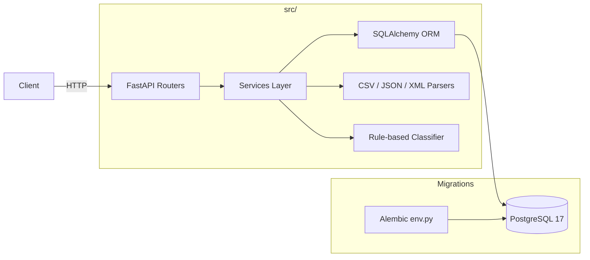

# 🎧 Homework 2: Intelligent Customer Support Ticket System

> **Student Name**: Taras Voroniuk
> **Date Submitted**: 2026-05-02
> **AI Tools Used**: Claude Code (orchestrator: Sonnet 4.6 / Opus 4.7), Claude Haiku 4.5 (sub-agent for code generation), Claude API tools — Context-Model-Prompt framework

---

## 📋 Огляд проєкту

Production-ready REST API для управління квитками технічної підтримки з мульти-форматним bulk-імпортом (CSV / JSON / XML), автоматичною rule-based класифікацією за категорією та пріоритетом, повним покриттям тестами й документацією.

**Stack:** Python 3.13 · FastAPI (async) · SQLAlchemy 2.0 (async) · Alembic · PostgreSQL 17 · Pydantic v2 · pytest · ruff · pyright

**Storage:** PostgreSQL 17 (через Docker Compose локально, через `DATABASE_URL` env vars у проді). Окрема `tickets_test` БД для тестів. Жодного SQLite — повний паритет prod ↔ test.

---

## 🏛 Архітектура (high-level)



Детальна архітектура з sequence-діаграмами flow `/tickets/import` і `/auto-classify` — у [docs/ARCHITECTURE.md](./docs/ARCHITECTURE.md).

---

## ✨ Реалізовані фічі

### Required (усі 5 Tasks)

- [x] **Task 1 — Multi-Format Ticket Import API**
  - `POST /tickets` — створення квитка (з опційним `?auto_classify=true` flag)
  - `POST /tickets/import` — bulk-import CSV / JSON / XML з detailed `ImportSummary`
  - `GET /tickets` — список з фільтрами по `category`, `priority`, `status`, `customer_id`, `assigned_to` + пагінація
  - `GET /tickets/{id}` · `PUT /tickets/{id}` · `DELETE /tickets/{id}`
  - Pydantic v2 валідація: email, длина subject (1–200), description (10–2000), enums, etc.
  - Bulk-import повертає per-row `errors[]` для невалідних записів
  - 413 RequestEntityTooLarge для файлів > 512 MiB (поріг налаштовується через `MAX_UPLOAD_SIZE_BYTES`)
- [x] **Task 2 — Auto-Classification**
  - `POST /tickets/{id}/auto-classify` — повертає `category`, `priority`, `confidence`, `reasoning`, `keywords_found`
  - Auto-run при створенні через `?auto_classify=true`
  - Стратегія — повністю rule-based, БЕЗ LLM у runtime (priority keywords з `TASKS.md` буквально; categories — з типових проблемних термінів)
  - Зберігає `classification_confidence` в БД; підтримує manual override через `PUT`
  - Усі рішення логуються через `logger.info`
- [x] **Task 3 — AI-Generated Test Suite**
  - **67 тестів** (passing) у 9 файлах
  - **Coverage 97.80%** (поріг — 85%)
  - `pytest` + `pytest-asyncio` + `pytest-cov` + `httpx.AsyncClient`
  - Окрема тестова БД `tickets_test`, ізоляція через TRUNCATE на teardown
- [x] **Task 4 — Multi-Level Documentation**
  - [README.md](./README.md) — для розробників (цей файл)
  - [docs/ARCHITECTURE.md](./docs/ARCHITECTURE.md) — для tech-leads (Mermaid діаграми, ADR)
  - [docs/API_REFERENCE.md](./docs/API_REFERENCE.md) — для API consumers
  - [docs/TESTING_GUIDE.md](./docs/TESTING_GUIDE.md) — для QA
  - 4 Mermaid діаграми: high-level architecture, sequence flow для import, sequence flow для classify, test pyramid
- [x] **Task 5 — Integration & Performance Tests**
  - `tests/test_integration.py` — 5 E2E flows (full lifecycle, bulk + classify, combined filters, mixed valid/invalid, partial update)
  - `tests/test_performance.py` — 5 benchmark тестів: 25 concurrent POST < 10s, bulk 50 rows < 5s, list 1000 < 2s, classifier 100 invocations < 1s, GET p95 < 200ms

### Optional
- [ ] (свідомо не виконано — згідно з принципом «не робити зайве», ДЗ №1 урок з рейтлімітером)

### Тести · Coverage

```
Tests:    67 passed
Coverage: 97.80%   (gate: 85%)
Markers:  unit (4), integration (52), performance (5), unmarked (6)
```

| Файл | Тестів | Призначення |
|---|---|---|
| `test_ticket_model.py` | 9 | ORM constraints, defaults, validation |
| `test_ticket_api.py` | 12 | CRUD endpoints + pagination |
| `test_import_csv.py` | 6 | CSV parser + endpoint |
| `test_import_json.py` | 5 | JSON parser + endpoint |
| `test_import_xml.py` | 5 | XML parser + endpoint |
| `test_categorization.py` | 10 | Classifier (priority + category) + endpoint |
| `test_edge_cases.py` | 10 | Coverage gap closures |
| `test_integration.py` | 5 | End-to-end workflows |
| `test_performance.py` | 5 | Concurrency, throughput, latency |

---

## 🌐 API Reference (короткий зріз)

Base URL: `http://localhost:8000`

| Method | Endpoint | Опис | Статус-коди |
|--------|----------|------|-------------|
| `GET`  | `/healthz` | Health check | 200 |
| `POST` | `/tickets` | Create ticket (з опц. `?auto_classify=true`) | 201, 422 |
| `GET`  | `/tickets` | List + filters + pagination | 200 |
| `GET`  | `/tickets/{id}` | Get one | 200, 404 |
| `PUT`  | `/tickets/{id}` | Partial update | 200, 404, 422 |
| `DELETE` | `/tickets/{id}` | Delete | 204, 404 |
| `POST` | `/tickets/import` | Bulk import (CSV/JSON/XML, multipart) | 200, 400, 413 |
| `POST` | `/tickets/{id}/auto-classify` | Run classifier on ticket | 200, 404 |

Повний контракт з прикладами cURL — у [docs/API_REFERENCE.md](./docs/API_REFERENCE.md). Інтерактивна Swagger UI — `http://localhost:8000/docs`.

**Основна модель (`TicketRead`):**
```json
{
  "id": "uuid",
  "customer_id": "string",
  "customer_email": "email",
  "customer_name": "string",
  "subject": "string (1-200)",
  "description": "string (10-2000)",
  "category": "account_access|technical_issue|billing_question|feature_request|bug_report|other",
  "priority": "urgent|high|medium|low",
  "status": "new|in_progress|waiting_customer|resolved|closed",
  "created_at": "ISO 8601 datetime",
  "updated_at": "ISO 8601 datetime",
  "resolved_at": "ISO 8601 datetime | null",
  "assigned_to": "string | null",
  "tags": ["string"],
  "metadata": {"source": "...", "browser": "...", "device_type": "..."},
  "classification_confidence": "float [0,1] | null"
}
```

---

## 🏗️ Архітектурні рішення

- **Шарова архітектура:** `api/` (роутери, тонкі) → `services/` (бізнес-логіка) → `models/` + `db/` (персистентність). Роутери валідують вхід через Pydantic, делегують у сервіси, формують відповідь.
- **DTO ≠ ORM:** `schemas/` (Pydantic) ізольовані від `models/` (SQLAlchemy). Можна змінювати API контракт без міграцій.
- **PostgreSQL everywhere:** свідомо обрано прод-БД для тестів (через docker-compose / GH Actions service). Уникає cross-dialect ускладнень, дозволяє вільно використовувати JSONB, native ENUM, ARRAY, `gen_random_uuid()`.
- **Rule-based classifier:** дотримуємось букви TASKS.md — Priority Rules задані буквально як keywords, тож LLM у runtime не потрібен. Це детерміновано, безкоштовно, тестується. AI використовується лише як **інструмент розробки** (Claude Code), не у самому застосунку.
- **DI через FastAPI `Depends`:** сервіси та session створюються per-request, легко override-яться у тестах.
- **Validation на межі:** Pydantic v2 на вході HTTP, SQLAlchemy ENUM/length constraints на виході в БД. Без надлишкових перевірок між шарами.
- **Layered exceptions:** парсери кидають `ParserError` (внутрішня), сервіси перетворюють на per-row error в `ImportSummary`, endpoints — на `HTTPException` з відповідними статусами.

Детальніше + sequence діаграми — у [docs/ARCHITECTURE.md](./docs/ARCHITECTURE.md).

### Інженерні знахідки під час розробки

- **`values_callable` для PG ENUM:** SQLAlchemy за замовчуванням мапить Python enum на `.name` (UPPERCASE), але TASKS.md вимагає `.value` (lowercase: `account_access` etc). Фікс — `PgEnum(Category, values_callable=lambda obj: [e.value for e in obj])`.
- **`concurrency = ["thread", "greenlet"]` у coverage:** SQLAlchemy async використовує greenlet всередині для bridge sync↔async. Без цього налаштування `pytest-cov` показував 67% для API модулів, хоча тести покривали їх повністю. Після фіксу — 97.80%.

---

## 🤖 Використання AI

### Робочий процес — Orchestrator + Sub-agent

Для цього ДЗ використано двохрівневий підхід:

| Роль | Модель | Що робить |
|---|---|---|
| **Orchestrator** | Claude Sonnet 4.6 / Opus 4.7 (Claude Code) | Планує, декомпонує задачу на phases, формує детальні промпти для саб-агентів, рев'ю згенерованого коду, інтегрує результати, веде todo-list |
| **Code Implementer** | Claude Haiku 4.5 (через Agent tool) | Пише модулі, тести, конфіги, міграції за чіткими специфікаціями |

Інструкції для саб-агента описані в `.claude/agents/code-implementer.md` (живе у Claude Code config, поза цим repo) — там зафіксовані стек, архітектура, anti-patterns, формат output. Memory правила — у локальній Claude Code пам'яті користувача.

### Different AI models for different artifact types (Task 4 requirement)

| Тип артефакту | Модель | Чому ця модель |
|---|---|---|
| Long-form documentation (README, ARCHITECTURE, API_REFERENCE, TESTING_GUIDE, HOWTORUN) | **Sonnet 4.6 / Opus 4.7** | Тримає у контексті всю історію проекту, ADR-и, інженерні знахідки — пише прозу зв'язно |
| Source code (api/, services/, models/, schemas/, parsers/, db/) | **Haiku 4.5** | Детермінована робота з чіткою специфікацією — швидко й дешево |
| Tests (67 tests across 9 файлів) | **Haiku 4.5** | Те саме — тестова логіка добре формалізується у промпті |
| Config files (pyproject, requirements, docker-compose, alembic) | **Haiku 4.5** | Точна структура, версії передані orchestrator-ом |
| Architecture decisions, trade-off analysis, debugging | **Sonnet 4.6 / Opus 4.7** (orchestrator) | Потрібне глибоке reasoning, рев'ю чужого коду, prompt engineering |

Це і є реалізація вимоги Task 4 — _"Use different AI models for different doc types"_: не один LLM на все, а навмисний розподіл ролей між tier-ами Claude.

### 10 фаз — як працював orchestrator

| Фаза | Підзадачі делеговані Haiku | Файлів | Wall time Haiku |
|---|---|---|---|
| **A** Scaffold | A1 configs, A2 Python infra, A3 Alembic | 18 | 161s |
| **B** Modelling | B1 models+schemas, B4 tests+conftest (B2/B3 — orchestrator) | 8 | 174s |
| **C** Task 1 CRUD | C1 service+DI, C2 router, C3 12 API tests | 7 | 95s |
| **D** Task 1 Import | D1 parsers, D2 importer+endpoint, D3 16 tests | 12 + 6 fixtures | 122s |
| **E** Task 2 Classifier | E1 classifier+schema, E2 endpoint+flag, E3 10 tests | 7 | 134s |
| **F** Coverage polish | F1 10 edge tests | 1 | 57s |
| **G** Integration / Perf | G1 5 integration, G2 5 perf | 2 | 90s |
| **H** Documentation | (writing docs done by orchestrator — context-heavy) | 4 | — |
| **I** CI | (orchestrator) | 1 | — |
| **J** Submit | (orchestrator) | — | — |

### Ключові промпти

1. **Phase A1 — Project configs.** Промпт містив повний контент 7 файлів (`pyproject.toml`, `requirements*.txt`, `docker-compose.yml`, etc.) з закріпленими версіями (latest stable PyPI станом на 2026-05-02). Sub-agent перевірив TOML парсингом. Корекція не потрібна.
2. **Phase B1 — Models + schemas.** Промпт містив повний код `Ticket` ORM, але я ще НЕ знав про `values_callable` нюанс. Знахідка прийшла на B3 при перегляді autogenerated міграції — UPPERCASE enum values. Виправив у моделі через Edit, перегенерував міграцію.
3. **Phase E1 — Rule-based classifier.** Промпт містив повний keyword list для priority (буквально з TASKS.md) і derived keyword list для categories. Sub-agent додав smoke check 3 тестових випадки.
4. **Phase F1 + greenlet fix.** Sub-agent написав 10 edge tests, але coverage не виросла з очікуваних 92%. Я перевірив `--cov-report=term-missing` і виявив що 12 рядків API endpoints не покриваються попри тести. Знахідка: SQLAlchemy async використовує greenlet для bridge — `pytest-cov` не трекає таке за замовчуванням. Один рядок у `pyproject.toml` (`concurrency = ["thread", "greenlet"]`) дав стрибок 89% → 97.80%.

### Що перевірив вручну

- Кожен файл, написаний саб-агентом, я читав перед переходом до наступного кроку (правило "trust but verify").
- Виправляв deviations (e.g. саб-агент додав `NullPool` в test fixture — прийняв як виправдане для async test isolation).
- Перевіряв SQL генерованих міграцій (виявив enum values_callable баг — описано вище).
- Smoke перевірки: `curl /healthz`, OpenAPI paths після кожного нового роутера, Postgres ENUM ranges, реальний bulk import з курлом.
- Coverage breakdown після кожної фази — щоб не пропустити gap.

### Виклики

- **Виклик 1:** PG native ENUM з UPPERCASE значеннями замість lowercase. → Виявив на B3 при перегляді autogenerate. Фікс — `values_callable`.
- **Виклик 2:** Coverage 67% для API модулів попри passing тести. → Виявив через `--cov-report=term-missing`. Фікс — `concurrency = ["thread", "greenlet"]`.
- **Виклик 3:** pytest-asyncio + asyncpg + session-scope engine + function-scope tests. → Sub-agent сам додав `NullPool` як виправдану deviation.
- **Виклик 4:** Спочатку я неправильно інтерпретував Task 2 і запропонував LLM-based классифікатор; користувач нагадав про досвід ДЗ №1 (зайвий рейтлімітер). → Скоригував до повного rule-based, що ідеально лягло на буквальні Priority Rules з TASKS.md.

---

## 📸 Скріншоти

Усі знаходяться в [`docs/screenshots/`](./docs/screenshots/):

| Файл | Що показує |
|---|---|
| [`swagger_ui.png`](./docs/screenshots/swagger_ui.png) | Swagger UI з усіма 8 endpoints + 14 schemas |
| [`test_coverage.png`](./docs/screenshots/test_coverage.png) | HTML coverage report — **97.80%** з per-module breakdown |
| [`tickets_list.png`](./docs/screenshots/tickets_list.png) | Реальний JSON response `GET /tickets?limit=5` з auto-classified ticket |
| [`classification_demo.png`](./docs/screenshots/classification_demo.png) | POST request → classifier response, `reasoning` і `keywords_found` для аудиту |

---

## ▶️ Як запустити

Все виконується через **Docker Compose** — нічого не встановлюється локально (ні Python, ні Postgres, ні pip-залежності).

```bash
cp .env.example .env
docker compose up -d --build                          # app + postgres
docker compose --profile test run --rm tests         # 67 tests, 97.80% coverage
open http://localhost:8000/docs
```

Повна покрокова інструкція (фільтри тестів, HTML coverage, lint, troubleshooting) — у [HOWTORUN.md](./HOWTORUN.md).

---

<div align="center">

*Виконано в межах курсу **GenAI and Agentic AI for Software Engineering**.*

</div>
