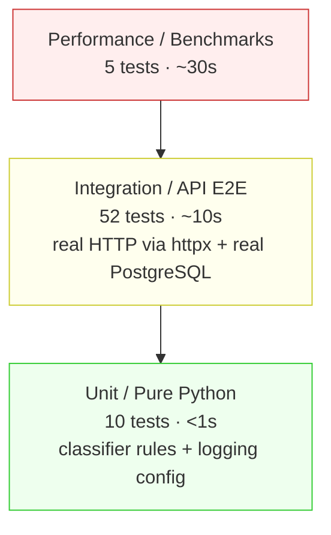
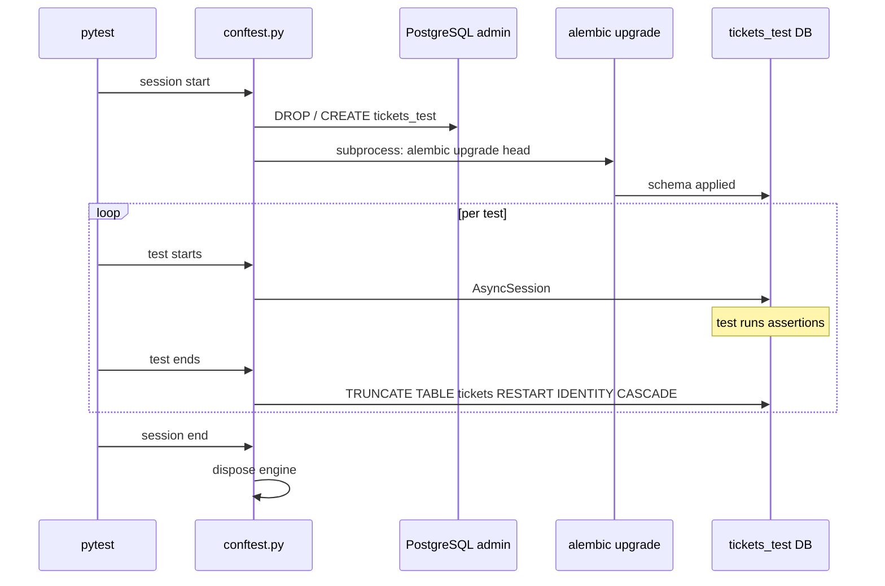

# 🧪 Testing Guide — Customer Support Ticket System

> Audience: QA engineers, developers verifying the test suite.

---

## 1. Test pyramid



| Tier | Marker | What it verifies |
|---|---|---|
| **Unit** | `@pytest.mark.unit` | Pure Python: classifier keyword matching (priority + category), logging config bootstrap |
| **Integration** | `@pytest.mark.integration` | Full HTTP stack via `httpx.AsyncClient` against the FastAPI app, real PostgreSQL, real Alembic migrations applied to `tickets_test` |
| **Performance** | `@pytest.mark.performance` | Latency / throughput / concurrency benchmarks — verify the system meets the timing thresholds in the spec |

---

## 2. How to run

### Pre-req

```bash
docker compose up -d postgres
```

Wait until `docker compose ps` shows `(healthy)`.

### All tests + coverage report

```bash
.venv/bin/pytest --cov=src --cov-report=term-missing
```

Expected output ends with `97.80%` (or higher) and `67 passed`.

### Filter by marker

```bash
# Fast unit tests only (~1s)
.venv/bin/pytest -m unit

# Integration only (no perf)
.venv/bin/pytest -m integration

# Performance only
.venv/bin/pytest -m performance

# Skip slow performance suite
.venv/bin/pytest -m "not performance"
```

### Filter by file or test name

```bash
# Single file
.venv/bin/pytest tests/test_ticket_api.py -v

# Single test
.venv/bin/pytest tests/test_ticket_model.py::test_subject_max_length_200

# By substring
.venv/bin/pytest -k "auto_classify"
```

### HTML coverage report

```bash
.venv/bin/pytest --cov=src --cov-report=html
open htmlcov/index.html
```

---

## 3. Test data

| Path | Purpose | Records |
|---|---|---|
| `tests/fixtures/sample_tickets.csv` | Valid CSV bulk import | 50 |
| `tests/fixtures/sample_tickets.json` | Valid JSON bulk import | 20 |
| `tests/fixtures/sample_tickets.xml` | Valid XML bulk import | 30 |
| `tests/fixtures/invalid_tickets.csv` | 3 invalid rows: bad email, missing name, short description | 3 |
| `tests/fixtures/invalid_tickets.json` | Truncated JSON (parser-level error) | — |
| `tests/fixtures/invalid_tickets.xml` | Unclosed tag (parser-level error) | — |

Generated via deterministic Python script with `random.seed(42)` — re-runnable.

In-test payloads use a `_payload(**overrides)` helper to keep the noise low; tests only state what they care about.

---

## 4. Test isolation strategy



- **Session-scoped** `test_engine` fixture creates `tickets_test` DB and runs Alembic.
- **Function-scoped** `db_session` and `client` fixtures truncate `tickets` after each test → independent test runs in any order.
- `client` fixture uses FastAPI's `app.dependency_overrides[get_session]` to inject the test session into the app stack.

---

## 5. Performance benchmarks

| Test | Target | Actual (M-series Mac, local Docker) |
|---|---|---|
| 25 concurrent `POST /tickets` | < 10s | ~0.5s |
| Bulk import 50 CSV records | < 5s | ~0.2s |
| Bulk import 1000 CSV records, then `GET /tickets?limit=200` | list < 2s | ~50ms |
| Classifier 100 invocations (sync, no DB) | < 1s | ~5ms |
| `GET /tickets/{id}` p95 latency over 50 calls | < 200ms | ~5ms |

The thresholds are **conservative** — designed to pass on slower CI runners. If a test fails on your machine, it's a real regression, not flake.

---

## 6. Manual testing checklist (pre-submit)

After all automated tests pass, sanity-check the user journeys:

### 6.1 Healthz + start

- [ ] `docker compose up -d postgres` — postgres becomes `healthy`
- [ ] `alembic upgrade head` — exit 0, no migrations re-applied
- [ ] `uvicorn src.main:app --reload` — starts cleanly
- [ ] `curl /healthz` → `200 {"status":"ok"}`
- [ ] Open `http://localhost:8000/docs` — Swagger UI lists 9 endpoints

### 6.2 CRUD

- [ ] `POST /tickets` with valid body → `201`, returns full payload
- [ ] `POST /tickets` with `customer_email: "broken"` → `422`
- [ ] `POST /tickets` with `description: "short"` → `422`
- [ ] `GET /tickets/{id}` → `200`
- [ ] `GET /tickets/00000000-...` → `404`
- [ ] `GET /tickets?limit=10` → 10 items + total
- [ ] `GET /tickets?category=billing_question` → only billing
- [ ] `PUT /tickets/{id}` with `{"status": "in_progress"}` → status changes, other fields preserved
- [ ] `DELETE /tickets/{id}` → `204`, then `GET` → `404`

### 6.3 Bulk import

- [ ] `POST /tickets/import` with `sample_tickets.csv` → `successful: 50`
- [ ] `POST /tickets/import` with `sample_tickets.json` → `successful: 20`
- [ ] `POST /tickets/import` with `sample_tickets.xml` → `successful: 30`
- [ ] `POST /tickets/import` with `invalid_tickets.csv` → `successful: 0, failed: 3`, three error rows
- [ ] `POST /tickets/import` with a `.txt` file → `400`

### 6.4 Auto-classification

- [ ] `POST /tickets/{id}/auto-classify` for a "production down" ticket → `priority: urgent`
- [ ] `POST /tickets/{id}/auto-classify` for a "refund invoice" ticket → `category: billing_question`
- [ ] `POST /tickets/{id}/auto-classify` on `00000000-...` → `404`
- [ ] `POST /tickets?auto_classify=true` with valid body → returned ticket already has classified fields
- [ ] `PUT /tickets/{id}` with manual `category: feature_request` overrides classifier → next `GET` reflects override

### 6.5 Logs

- [ ] In server stdout, classification calls produce a line like:
  `INFO src.services.classification_service: auto_classify ticket=<uuid> category=urgent priority=account_access confidence=0.45`

---

## 7. Coverage breakdown — what's not at 100%

| Module | Coverage | Why |
|---|---|---|
| `src/api/import_.py` | 88% | The 413 (file > 512 MiB) path is hard to test without generating a 500+ MiB file in fixtures — chose not to. |
| `src/parsers/csv_parser.py` | 91% | UnicodeDecodeError path requires deliberately corrupt UTF-8 bytes. |
| `src/parsers/json_parser.py` | 90% | "Item is not an object" path requires JSON like `[1, 2]`. Not covered. |
| `src/services/importer.py` | 92% | DB-error rollback path (`SQLAlchemyError` mid-batch) requires mock or chaos injection. |

Total: **97.80%** — well above the 85% gate from `pyproject.toml`.

---

## 8. Linting & type checking

These run as part of CI but are useful locally too:

```bash
.venv/bin/ruff check src/ tests/ alembic/env.py
.venv/bin/ruff format --check src/ tests/ alembic/env.py
.venv/bin/pyright src/ tests/
```

All three should report 0 issues. Ruff selects `E, F, I, B, UP, S, N, SIM`; pyright runs in `basic` mode reading from `.venv` for type stubs.
